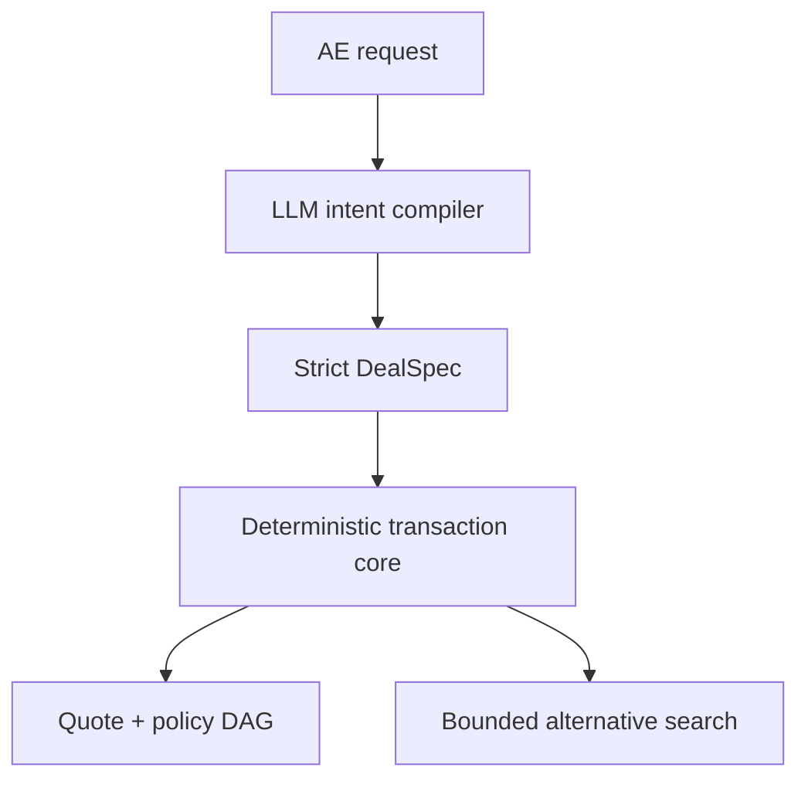

# Deal Compiler

**The model proposes. The transaction engine proves.**

Deal Compiler turns an account executive's unstructured request into an inspectable quote, approval DAG, and set of policy-valid alternatives. The LLM is deliberately constrained to language understanding. It cannot calculate prices or decide approvals.

> “Quote Acme Robotics for 420 seats over 3 years. Start at 100k compute credits and double annually. Keep year one under a $900k budget, Net 60, US + EU, premium support, with a 12% discount.”

That request compiles into:

- a strict, replayable `DealSpec`;
- a three-year price timeline using integer cents and basis points;
- a parallel approval graph with rule IDs, reasons, dependencies, and critical-path SLA;
- counterfactuals such as the highest-revenue budget-compliant quote and the fastest approval path;
- a typed event log with stable digests.

This is a focused portfolio prototype built over a weekend. The catalog, customer, and policies are synthetic.

## Trust boundary



The critical design choice is what the model **does not** own:

| Concern | Owner | Why |
|---|---|---|
| Ambiguous language and normalization | LLM | This is probabilistic interpretation work. |
| Schema validation | Zod boundary | Invalid structures fail before execution. |
| Price, discount, and margin | Pricing kernel | Money uses integer cents; discounts use basis points. |
| Approval routing | Policy engine | Every trigger maps to an explicit rule and dependency. |
| Alternatives | Bounded deterministic search | Every candidate is fully re-priced and re-routed. |
| Replay | Typed event log | State transitions are ordered and digestible. |

## Vertical slice

The synthetic Atlas catalog includes:

- a platform fee;
- graduated seat tiers;
- prepaid compute credits with annual ramps;
- EU data residency and private-cloud add-ons;
- premium support calculated from the product subtotal.

The policy engine demonstrates merged and parallel routing:

- discount above 10% → Sales Manager;
- discount above 20% → VP Sales after manager;
- Net 60 or gross margin below 65% → Finance;
- EU → Legal and Security in parallel;
- private cloud → Security (merged with any EU reason);
- TCV above $2M → CFO after any commercial prerequisites.

## Performance and verification

On the local development runner:

| Operation | Samples | p99 |
|---|---:|---:|
| Price + route | 130,859 | 0.01 ms |
| Bounded counterfactual search | 29,964 | 0.07 ms |

These figures measure the in-process deterministic core, not network or model latency. Reproduce them with `npm run bench`.

The suite currently covers 13 cases across graduated pricing, ramp carry-forward, subtotal reconciliation, approval dependencies, approver deduplication, auto-approval, budget-valid counterfactuals, parser normalization, and event replay.

```bash
npm test
npm run bench
npm run lint
npm run build
```

## Run locally

Requires Node.js 20.9 or newer.

```bash
npm install
cp .env.example .env.local
npm run dev
```

Add an existing OpenAI API key to `.env.local` to enable model-backed compilation:

```dotenv
OPENAI_API_KEY=your_key_here
OPENAI_MODEL=gpt-5.6-luna
```

The key is server-only and `.env*` is ignored. The API uses the OpenAI Responses API with Zod Structured Outputs. Without a key, the UI transparently labels and uses a narrow deterministic parser so the transaction core remains explorable.

## Project map

```text
src/app/api/compile/route.ts  Language → DealSpec boundary
src/lib/pricing.ts            Fixed-point pricing kernel
src/lib/approvals.ts          Policy evaluation and approval DAG
src/lib/alternatives.ts       Bounded counterfactual search
src/lib/compiler.ts           Orchestration and replay events
src/components/               Interactive workbench
tests/                        Golden cases and microbenchmarks
docs/                         Architecture, demo, and user-test notes
```

## Deliberate limitations

This is a narrow production-shaped slice, not a CPQ clone. It does not include authentication, CRM sync, tax, multi-currency, quote PDFs, durable event storage, or a policy authoring interface. The next production steps would be tenant-scoped persistence, idempotent workflow execution, versioned catalogs and policies, authorization at each transition, model evals against annotated AE requests, and observability across the model and deterministic stages.

See [architecture.md](docs/architecture.md) for the tradeoffs and [demo-script.md](docs/demo-script.md) for the 90-second walkthrough.
